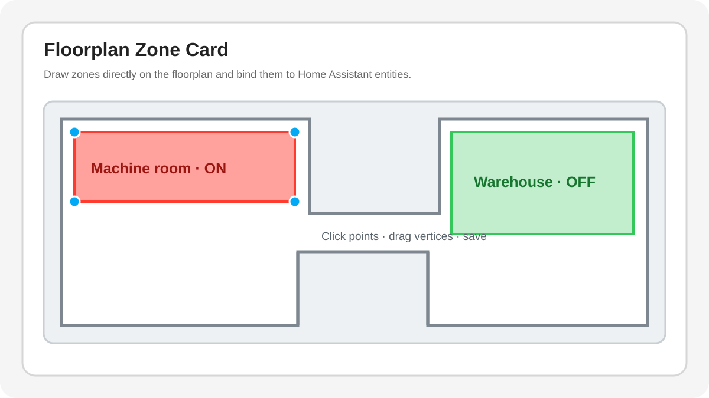

# Floorplan Zone Card

A Home Assistant custom dashboard card for displaying a floorplan with simple polygon zones driven by entity state.



The goal is a configuration flow that does **not** require editing SVG files, writing YAML overlays, or maintaining custom CSS:

1. choose or upload a floorplan image;
2. add a zone;
3. draw the zone directly on the floorplan;
4. select a `binary_sensor` from the Home Assistant entity picker;
5. choose ON/OFF colors and opacity;
6. save the card in the normal Home Assistant dashboard editor.

> [!IMPORTANT]
> This repository is in active early development. The editor now uses Home Assistant-native image/media and entity selectors, supports point-by-point polygon drawing, draggable vertices, and vertex insertion/removal directly on the floorplan.

## Current development scope

- Home Assistant custom card registration through `window.customCards`.
- Native graphical card editor through `getConfigElement()` and `config-changed`.
- Home Assistant image/media selector with image upload support.
- Backward-compatible support for legacy image URL/path configurations.
- Home Assistant entity selector restricted to `binary_sensor`.
- Home Assistant form controls for zone colors and opacity sliders.
- Responsive image + SVG overlay renderer.
- Resolution of `media-source://` images through Home Assistant before rendering.
- Normalized polygon coordinates (`0..1`) so zones remain aligned while resizing.
- Point-and-click polygon drawing with close/cancel/undo controls.
- Existing-zone selection and draggable polygon vertices.
- Midpoint handles for inserting new vertices.
- Selected-vertex deletion while preserving the minimum three-point polygon.
- Vertex updates committed only on pointer release.
- `binary_sensor` ON/OFF/unavailable styling.
- HACS-compatible `dist/ha-floorplan-zone-card.js` output.

## Example configuration

The visual editor writes this configuration automatically. A floorplan selected or uploaded with Home Assistant is stored as a media reference:

```yaml
type: custom:floorplan-zone-card
image:
  media_content_id: media-source://image_upload/xxxxxxxx
  media_content_type: image/png
zones:
  - id: zone_1
    name: Machine room
    entity: binary_sensor.machine_room_alarm
    points:
      - x: 0.2
        y: 0.2
      - x: 0.8
        y: 0.2
      - x: 0.8
        y: 0.8
      - x: 0.2
        y: 0.8
    "on":
      color: "#ff3b30"
      opacity: 0.55
    "off":
      color: "#808080"
      opacity: 0.08
```

Existing configurations using a direct URL or Home Assistant `/local/` path remain supported:

```yaml
image: /local/floorplan.png
```

They can be kept as-is or replaced later from the visual editor with the native image picker.

## Shape editing

When a zone is in **Edit shape** mode:

- drag a blue vertex to move it;
- click a small white midpoint handle to insert a new vertex on that edge;
- the last moved/inserted vertex becomes selected;
- use **Delete vertex** to remove it when the polygon has more than three points;
- coordinates are saved only when the pointer is released.

## Development

Requires Node.js 22 or newer. There are no runtime or build dependencies in the current development version.

```bash
npm run check
npm run build
```

The production file is written to:

```text
dist/ha-floorplan-zone-card.js
```

## Roadmap

### Milestone 1 — foundation

- [x] Card registration
- [x] Graphical config editor registration
- [x] Image + SVG overlay
- [x] Normalized polygon model
- [x] Live binary sensor styling
- [x] Basic zone properties

### Milestone 2 — graphical polygon editor

- [x] Add-zone drawing mode
- [x] Click points directly on the image
- [x] Close/cancel polygon controls
- [x] Undo last point while drawing
- [x] Select existing polygons
- [x] Drag polygon vertices
- [x] Delete/insert vertices
- [x] Commit config changes on pointer release rather than every pointer move

### Milestone 3 — Home Assistant-native UX

- [x] Native Home Assistant image upload/media selector
- [x] Native entity selector restricted to `binary_sensor`
- [x] Native color and opacity controls
- [ ] Undo/redo for saved shape edits
- [ ] Mobile editor polish
- [ ] Runtime UX testing on a real Home Assistant dashboard

## License

MIT
